# 计算机视觉 Computer Vision

本仓库内为2022年春季学期中山大学计算机学院计算机视觉的期末大作业。

文件说明：

├── 题目1                            // 题目1代码与实验结果
│   ├── src文件夹                 // 源代码
│   └── result1文件夹           // 实验结果
│       ├── gif文件夹             // 119.png与319.png对应的gif动图
│       └── config文件夹       // 其他图片的执行结果
│
├── 题目2                          	        // 题目2代码与实验结果
│   ├── src文件夹              	        // 源代码
│   └── result2文件夹       	        // 实验结果
│
├── 题目3                    		 // 题目3代码与实验结果
│   ├── dataset文件夹           		 // 测试集与训练集数据
│   ├── result3文件夹    		 // 实验结果
│   └── src文件夹       		 // 源代码
│       ├── segmentation.py    		 // 复用题目2代码，生成训练集与测试集
│       └── classification.py          	 // 用于完成题目3的题目要求
├── 计算机视觉期末大作业.pdf      // 实验要求
│
└── README.md          // 实验报告

---

This is the final assignment of the Computer Vision course of School of Computer Science & Engineering, Sun Yat-Sen University in the spring semester of 2022.

Document description:

├── 题目1 	//  Code and experimental results of Question 1
│ ├── src folder 			// Source code
│ └── result1 folder	 // Results
│	 ├── gif folder			 // 119.png and 319.png corresponding gif
│ 	└── config folder	 // Other image execution results
│
├── 题目2	 //  Code and experimental results of Question 2
│ ├── src folder 				// Source code
│ └── result2 folder 		// Results
│
├── 题目3 	//  Code and experimental results of Question 3
│ ├── dataset folder 		// Test set and training set data
│ ├── result3 folder 		// Results of experiments
│ └── src folder				 // Source code
│ 	├── segmentation.py 	// Reuse problem 2 code to generate training sets and test sets
│ 	└── classification.py 	// Used to complete the requirements of problem 3
├── 计算机视觉期末大作业.pdf   // Experimental requirements
│
└── README.md   	// Experiment report

---

[TOC]


## 题目1

### 1.问题描述

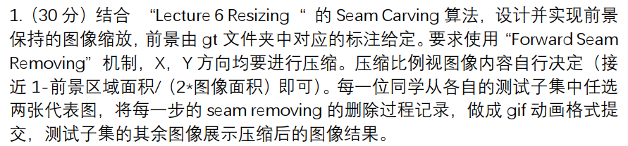 

### 2.求解过程

#### 2.1 算法原理

1. 对于给定的图像 ，能量函数定义如下：

$$
E(I)=|\frac{\partial I}{\partial x }| + |\frac{\partial I}{\partial y }|
$$

2. 对应某⼀像素点，它的能量越小，则越不重要。而seam线是由图像中那些不重要的像素点组成的。
   竖直方向的seam，公式如下：

$$
s^y=\{s^y_j\}^m_{j=1}=\{ (j,y(j))\}^m_{j=1} , s.t.\space  \forall j,|y(j)-y(j-1)|\le l
$$

​		水平方向的seam，公式如下：
$$
s^x=\{s^x_i\}^n_{i=1}=\{ (x(i),i)\}^n_{i=1} , s.t.\space  \forall i,|x(i)-x(i-1)|\le l
$$

3. 每一条seam的代价函数定义如下：

$$
E(s)=E(I_s)= {\textstyle \sum_{i=1}^{n}}e(I(s_i))
$$

​		最佳的seam是指价函数值最⼩的seam，定义公式如下 :
$$
s^*=\min_{s}E(s)=\min_{s}{\textstyle \sum_{i=1}^{n}}e(I(s_i))
$$

4. 在具体实现时，采用Forward Seam Removing机制来计算删除seam后增加的energy。
   需要考虑的三种情形如下：

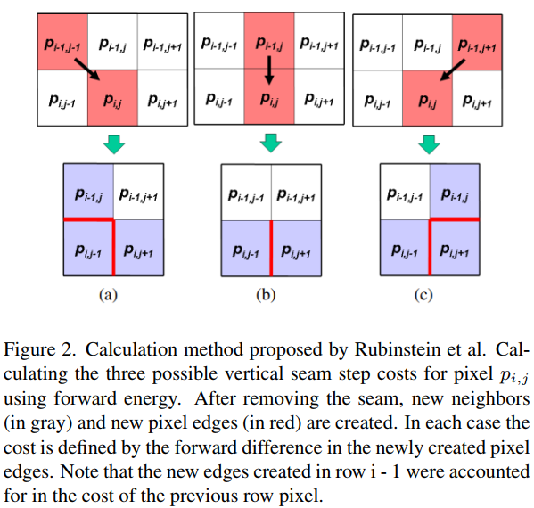

​	对应的计算公式如下：
$$
F_L(i,j)=|I(i,j-1)-I(i-1,j)|
    +|I(i,j+1)-I(i,j-1)|\\
 F_U(i,j)=|I(i,j+1)-I(i,j-1)|\ \ \ \ \ \ \ \ \ \ \ \ \ \ \ \ \ \ \ \ \ \ \ \ \ \ \ \ \ \ \ \ \ \ \ \ \ \ \ \ \ \ \ \ \ \\\
F_R(i,j)=|I(i,j+1)-I(i,j-1)| +|I(i,j+1)-I(i-1,j)|
$$

5. 结合动态规划的方法来寻找最佳的seam：

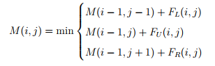

#### 2.2 关键代码实现

​		上述算法原理的实现如下列代码所示。
​		代码计算的是竖直方向上每条seam的代价之和，对于水平方向seam代价的计算，可以将图像旋转90度，复用下面的代码进行求解。对于其他部分的实现，源代码中都有相应的注释，在此不再赘述。

~~~python
        for hIndex in range(height):  # 从上到下逐行处理
            M = np.zeros((width, 3))
            # 采用 Forward Seam Removing 机制进行计算（以矩阵为计算单元）
            M[:, 0] = dynamicEnergyMap[hIndex, :-2] + np.abs(paddingImg[hIndex][1:-1] - paddingImg[hIndex + 1][:-2])
            M[:, 1] = dynamicEnergyMap[hIndex, 1:-1]
            M[:, 2] = dynamicEnergyMap[hIndex, 2:] + np.abs(paddingImg[hIndex][1:-1] - paddingImg[hIndex + 1][2:])
            colEnergy = np.abs(paddingImg[hIndex + 1][2:] - paddingImg[hIndex + 1][:-2])
            dynamicEnergyMap[hIndex + 1, 1:-1] = np.min(M, axis=1)
            routeMap[hIndex] = np.argmin(M, axis=1) - 1
            # 处理边界点
            # 像素(i,0)只能选择(i-1,0)和(i-1,1)
            if M[0, 1] <= M[0, 2]:
                routeMap[hIndex, 0] = 0
                dynamicEnergyMap[hIndex + 1, 1] = M[0, 1]
            else:
                routeMap[hIndex, 0] = 1
                dynamicEnergyMap[hIndex + 1, 1] = M[0, 2]
            # 像素(i,-1)只能选择(i-1,-1)和(i-1,-2)
            if M[-1, 0] <= M[-1, 1]:
                routeMap[hIndex, -1] = -1
                dynamicEnergyMap[hIndex + 1, -1] = M[-1, 0]
            else:
                routeMap[hIndex, -1] = 0
                dynamicEnergyMap[hIndex + 1, -1] = M[-1, 1]
            dynamicEnergyMap[hIndex + 1, 1:-1] += colEnergy  # 计算最终的energy
~~~


### 3.中间实验结果示例

以119.png、319.png为例，显示出删除的每一条Seam的情况，如下图所示。可以看到，删除的Seam都绕开了Mask覆盖的区域。

|                        | 119.png                                                      | 319.png                                                      |
| ---------------------- | ------------------------------------------------------------ | ------------------------------------------------------------ |
| 原图                   | 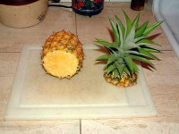 |  |
| Mask                   | 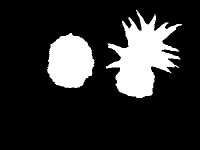 |  |
| 结果（包含删除的Seam） | 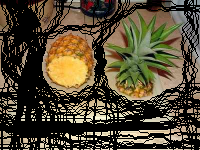 | 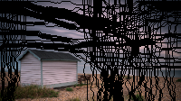 |

### 4.结果展示和分析  

#### 4.1 结果展示

缩小比例的计算公式：1-背景区域面积/（3*图像面积），处理后各个图像结果如下所示。

| 处理图像（.png） | 原图                                                         | Mask                                                         | 处理后的结果                                                 |
| ---------------- | ------------------------------------------------------------ | ------------------------------------------------------------ | ------------------------------------------------------------ |
| 19               |  | 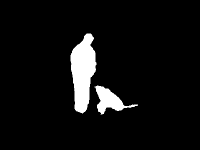     |  |
| 119              |  |  | 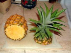            |
| 219              |  |     |             |
| 319              |  |  |             |
| 419              |     |  |             |
| 519              |  |     |             |
| 619              |     |  |             |
| 719              |  |     |             |
| 819              | 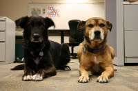 | 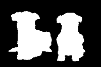    |             |
| 919              | 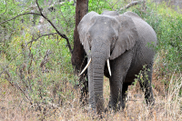    |  | 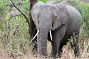            |

#### 4.2 分析

​		原本缩小比例的计算公式是：1-前景区域面积/（2\*图像面积），但是对于部分前景较小的图片，按照该公式计算的缩小比例较小，不利于直观展示实验结果，因此将计算公式改为1-背景区域面积/（3\*图像面积），即缩小背景区域面积的1/3。
​		从上述的结果中可以看出，原始图像中的主要内容得到了保留，删除的内容集中在背景区域，另外由于采用的是Forward Seam Removing，因此删除之后背景区域中的线条也较为连贯（例如719.png中的椅子靠背，919.png中的树枝等），不会出现衔接不自然的情况。
​		上述的实验结果保存在result1/png文件夹中。另外选取了两张图生成了对应的gif动图，保存在result1/gif文件夹中。

​	

## 题目2

### 1.问题描述

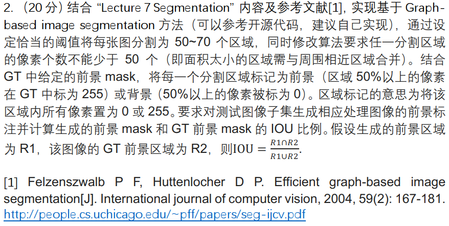 

### 2.求解过程

#### 2.1 定义图结构

​		Graph-Based Image Segmentation 是一种经典的图像分割算法，本质上是基于图的贪心聚类算法。在具体实现的时候，先构建图结构 $G=(V,E)$ ，图中的每个像素点 $v \in V$ ，每个像素点与周围八邻域内的像素点构成边 $e \in E$ ，每条边包含顶点$v_i,v_j$ ，以及该边的权值 $w(v_i,v_j)$。该权重的计算方式采用欧氏距离来定义。公式如下：

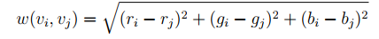

​		另外，对于每个像素点（x,y）的表示采用哈希公式$y*width+x$ 来计算和表示。

构建图的关键代码：

~~~python
def build_graph(img, width, height):
    '''
    建立图结构
    :param img: 输入的待处理图片
    :param width: 图片宽度
    :param height: 图片高度
    :return: 构建好的图
    '''
    graph = []
    for y in range(height):
        for x in range(width):
            # 计算八邻域内的相似度，实现每个方向取4个方向即可
            if x < width - 1:
                graph.append(create_edge(img, width, x, y, x + 1, y))
            if y < height - 1:
                graph.append(create_edge(img, width, x, y, x, y + 1))
            if x < width - 1 and y < height - 1:
                graph.append(create_edge(img, width, x, y, x + 1, y + 1))
            if x < width - 1 and y > 0:
                graph.append(create_edge(img, width, x, y, x + 1, y - 1))
    return graph
~~~

构建边的关键代码：

~~~python
def create_edge(img, width, x1, y1, x2, y2):
    '''
    计算RGB距离并创建图的边
    :param img: 待处理图片
    :param width: 图片宽度
    :param x1: 像素点1的x坐标
    :param y1: 像素点1的y坐标
    :param x2: 像素点2的x坐标
    :param y2: 像素点2的y坐标
    :return: 构建好的边信息
    '''
    # 分通道计算RGB距离
    r = math.pow((img[0][y1, x1] - img[0][y2, x2]), 2)
    g = math.pow((img[1][y1, x1] - img[1][y2, x2]), 2)
    b = math.pow((img[2][y1, x1] - img[2][y2, x2]), 2)
    return (y1 * width + x1, y2 * width + x2, math.sqrt(r + g + b))
~~~

#### 2.2 划分区域

​		初始化的时候每个像素点都作为独立的一个区域，之后按照 Graph-Based Image Segmentation 算法的内容，对所有边连接的两个不同区域$C_1,C_2$，执行$Merge(C_1,C_2)$，直到算法收敛。需要注意的是在$in(C_1,C_2)$中引入了超参数k，用于控制聚类的程度，通过调节k可以保证最终区域的个数在50-70个之间。

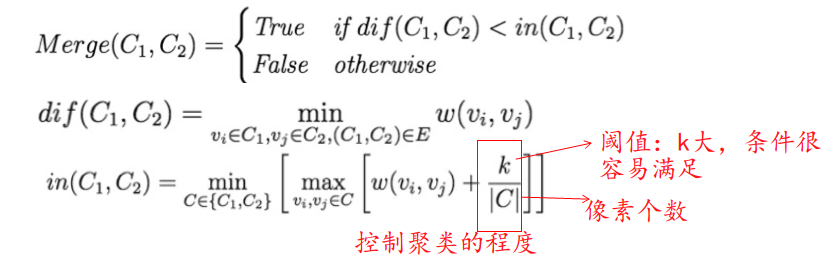

​		上述内容的关键代码如下：

~~~python
def segment_graph(sorted_graph, num_node, k):
    '''
    对图结构进行分割
    :param sorted_graph: 根据权重对所有的边排序后的图结构
    :param num_node: 节点总数
    :param k: 控制聚类程度的阈值
    :return: 分割后的结果
    '''
    res = area(num_node)
    # 记录各个区域的类内不相似度
    threshold = [k] * num_node
    for edge in sorted_graph:
        u = res.find_parent(edge[0])  # 边的端点1
        v = res.find_parent(edge[1])  # 边的端点2
        w = edge[2]  # 边的权重
        # 如果边接连的两点不属于同一区域
        if u != v:
            # 如果边的权重小于阈值
            if w <= threshold[u] and w <= threshold[v]:
                # 合并两个节点
                res.merge2node(u, v)
                parent = res.find_parent(u)
                # 更新最大类内间距
                threshold[parent] = np.max([w, threshold[u], threshold[v]]) + k / res.size[parent]
    return res
~~~

#### 2.3 处理聚类后的结果

​		由于题目中要求每个区域内的像素个数不得少于50个，因此要进一步处理聚类后的结果，将少于50个像素点的区域与其他区域进行合并。关键代码如下所示：

```python
def remove_small_area(res, sorted_graph, min_size):
    '''
    移除像素个数小于阈值的区域
    :param res: 分割后的图结构
    :param sorted_graph: 根据权重对所有的边排序后的图结构
    :param min_size: 每个分割区域的最少像素个数
    :return: 处理后的图结构
    '''
    for edge in sorted_graph:
        u = res.find_parent(edge[0])
        v = res.find_parent(edge[1])
        if u != v:
            if res.size[u] < min_size or res.size[v] < min_size:
                res.merge2node(u, v)
    print('  区域个数: ', res.num_set)
    return res
```

​		由此完成了Graph-Based Image Segmentation 算法的内容，之后只要将处理后的图结构中的各个区域进行添加颜色，并计算IOU；最后再保存结果即可，这部分不是算法的主要内容，源代码中均有注释，因此不再赘述。

### 3.中间实验结果示例

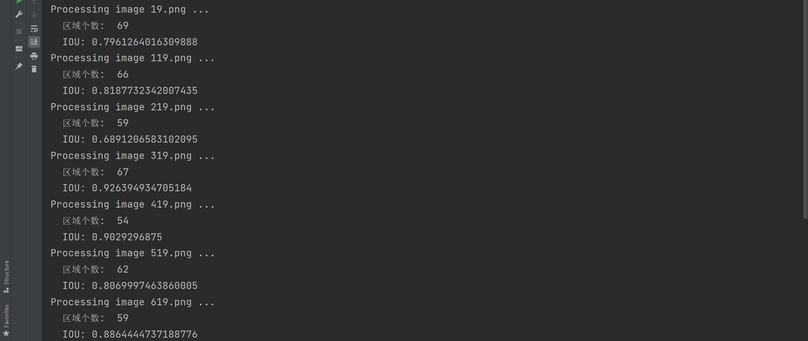
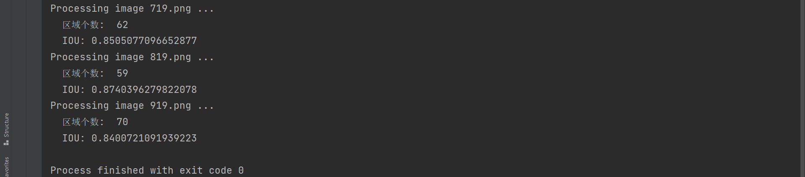

### 4.结果展示和分析  

#### 4.1 结果展示

| 处理图像（.png） | 原图                                                         | Mask                                                         | 标记结果                                                     | 处理结果                                                     | IOU    | 区域总数 |
| ---------------- | ------------------------------------------------------------ | ------------------------------------------------------------ | ------------------------------------------------------------ | ------------------------------------------------------------ | ------ | -------- |
| 19               |  |      |  |  | 0.7961 | 69       |
| 119              |  |  |  |  | 0.8188 | 66       |
| 219              |  |     |  |  | 0.6891 | 59       |
| 319              |  |  |  |  | 0.9264 | 67       |
| 419              |     |  |  |  | 0.9029 | 54       |
| 519              |  |     |  |  | 0.8070 | 62       |
| 619              |     |  |  |  | 0.8864 | 59       |
| 719              |  |     |  |  | 0.8505 | 62       |
| 819              |  |     |  |  | 0.8704 | 59       |
| 919              |     |  |  |  | 0.8401 | 70       |

#### 4.2 分析

​		对于划分的每个区域，其中的像素点都不少于50个，另外，为了保证划分为50-70个区域，对于每张图片，采用的阈值 k 不同，对应的阈值 k 依次是：6.6, 3, 5.8, 2, 1.8, 6, 6.8, 6, 5, 12。处理后的具体结果保存在 result2 文件夹中，可以看到大部分图片的IOU保持在85%左右，相对来说是比较高的。
​		219.png的IOU相比其他图片而言较低，主要是因为mask中猪的部分肤色与background中土地的颜色较为接近，因此导致算法将其归并为同一区域。这主要是由算法本身的局限性造成。出现类似情况的还有819.png中黑狗与背景中的黑色区域。但整体上看，算法还是比较好的完成了区域划分的任务，同时具有较高的IOU，符合实验的预期要求。


## 题目3

### 1.问题描述

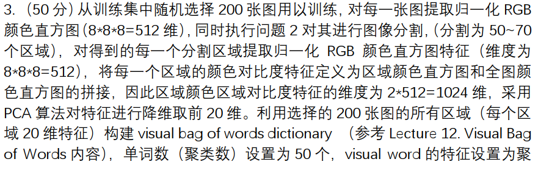
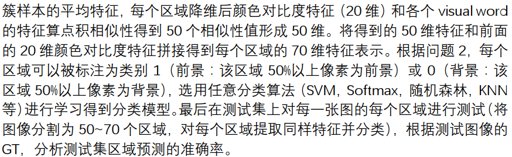

### 2.求解过程

#### 2.1 生成训练集和测试集数据

​		抽取编号为 0(mod5) 的图片，正好有200张，之后在这些图片上执行题目二的代码，完成分割任务，从而得到训练集的数据。存放在train文件夹中。
​		再使用题目二的结果作为测试集数据。存放在test文件夹中。

#### 2.2 颜色区域对比度特征  

##### 2.2.1 区域颜色直方与全图颜色直方图  

​		题目要求每种颜色是8维，故直方图的interval为256/8=32。区域颜色直方图与全图颜色直方图代码基本相同，图片在于是否采用mask（此处mask指的是题目二代码生成的mask）的信息。关键代码如下：

~~~python
    # 若没有mask，则将图像变为(height*width,3)的一列像素
    if mask is None:
        height, width, _ = img.shape
        img = np.reshape(img, newshape=(height * width, 3))
    # 若有mask，则只处理mask覆盖区域，其他区域像素不参与直方图的计算
    else:
        assert img.shape[:2] == mask.shape  # 判断尺寸是否一致
        front_size = len(mask[mask == 255])  # mask大小
        ret = np.zeros(shape=(front_size, 3), dtype=np.uint8)
        height, width = img.shape[:2]
        index = 0
        for h in range(height):
            for w in range(width):
                if mask[h, w] == 255:
                    ret[index] = img[h, w]
                    index += 1
        img = ret
~~~

​		之后计算各个像素的RGB特征，并进行统计，形成直方图。关键代码如下：

~~~python
	# 计算直方图
    for p in range(length):  # 依次处理每个像素点
        v = img[p, :]
        # 计算三个通道归属的区间
        i = math.floor(v[0] / interval)
        j = math.floor(v[1] / interval)
        k = math.floor(v[2] / interval)
        colorspace[i, j, k] += 1
~~~

​		为了消除图片大小对直方图特征的影响，最后好要进行归一化处理，即除以像素的总个数。

##### 2.2.2 拼接并采用PCA 算法降维取前 20 维  

​		经过上述处理，区域颜色区域对比度特征的维度为 2*512=1024 维，再采用PCA 算法对特征进行降维取前 20 维。此处的PCA算法直接调库，未进行实现。
​		为了后面实现visual bag of words dictionary，需要分别提取各个区域的颜色区域对比度特征，因此遍历分割任务后的各个区域，进行拼接。关键代码如下：

```python
# 拼接区域颜色直方图和全图颜色直方图
	fvec = np.concatenate((comp_fvec, img_fvec))
```

​		之后汇总形成训练集数据，在整个训练集上进行PCA降维。关键代码如下：

```python
'''在整个训练集上进行PCA降维'''
# PCA降维
x_train = PCA(n_components=20).fit_transform(x_train)
```
#### 2.3 构建 visual bag of words dictionary  

​		使用Kmeans聚类方法获得50个聚类中心点，在此直接调用sklearn库函数实现。  之后计算颜色对比度特征和50个visual word特征的点积结果，得到50维数据，再与之前PCA算法得到的20维数据拼接，得到70维的数据集。关键代码（以生成训练集数据为例）如下：

~~~python
# 构建 visual bag of words dictionary
kmeans_trainer = cv2.BOWKMeansTrainer(50)  # 使用K-Means聚类方法获得50个聚类中心点
kmeans_trainer.add(np.float32(x_train))
v1 = kmeans_trainer.cluster()
# np.dot(x_train, v1.T))是颜色对比度特征和各个 visual word特征的点积结果
x_train = np.hstack((x_train, np.dot(x_train, v1.T)))  # 将参数元组的元素数组按水平方向进行叠加，得到70维特征
~~~

#### 2.4 采用SVM学习获得分类模型

​		采用非线性SVM对之前得到70 维特征进行学习，得到分类模型，非线性SVM直接调库，未进行实现。学习后在测试集上进行测试，分别输出训练集和测试集的准确率（准确率的计算调用sklearn库的accuracy_score）。代码如下：

```python
def test(x_train, y_train, x_test, y_test):
    # 非线性SVM
    clf = make_pipeline(StandardScaler(), SVC(gamma='auto'))
    clf.fit(x_train, y_train)
    y_train_predict = clf.predict(x_train)
    y_test_predict = clf.predict(x_test)
    print("训练集的准确率：", accuracy_score(y_train, y_train_predict))
    print("测试集的准确率：", accuracy_score(y_test, y_test_predict))
```

  		

### 3.中间实验结果示例

#### 3.1 生成训练集和测试集数据

抽取编号为 0(mod5) 的图片，正好有200张，之后在这些图片上执行题目二的代码，得到训练集的数据。再使用题目二的结果作为测试集数据。分别存放在train和test文件夹中。

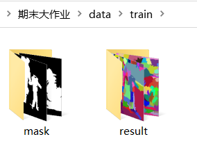

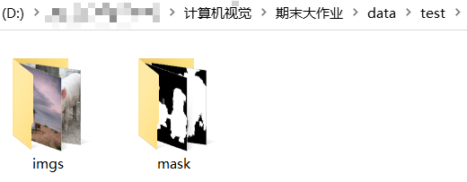

#### 3.2 执行算法

执行结果（部分）：

~~~
Train Set:
Processing 5.png ...
Processing 10.png ...
Processing 15.png ...
...（省略）
Processing 990.png ...
Processing 995.png ...
Processing 1000.png ...
Test Set:
Processing 19.png ...
Processing 119.png ...
...（省略）
Processing 819.png ...
Processing 919.png ...
训练集的准确率： 0.8255387257963772
测试集的准确率： 0.7953172205438066

Process finished with exit code 0
~~~


### 4.结果展示和分析  

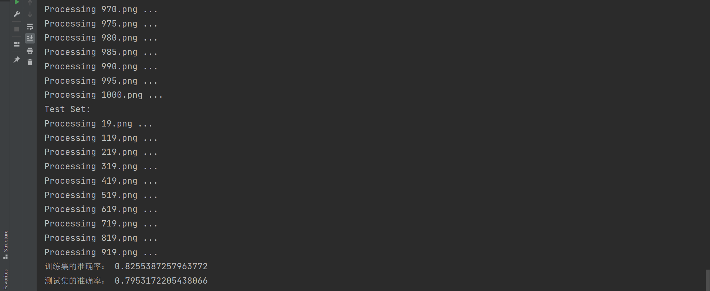

训练集的准确率约为 0.8255，测试集的准确率约为 0.7953。


## 题目4

### 1.问题描述

​		结合“Lecture 10. Dimensionality Reduction”中学习的方法，每一位同学从各自的测试子集中任选一张代表图，执行 PCA 压缩。先将图片尺寸缩放或裁减为 12的倍数，以 12*12 patch 为单位执行 PCA 压缩，1）展示 16 个最主要的特征向量的可视化图，2）展示 144D，60D，16D 和 6D 的压缩结果。需要介绍算法流程和对应的结果展示。  

### 2.求解过程

#### 2.1 实现过程

​		PCA算法的本质就是寻找一组更低维度下的正交基，使得原数据在这组正交基下的方差最大。因为方差越大，数据在对应正交基上保留的信息量越大；反之，方差越小数据对应正交基上保留的信息量越小。由于选定的这组正交基之外的信息方差较小，即信息量较小，因此可以删除，从而达到降维的目的。
​		在完成题目时，先将图片缩放或裁减为12的倍数，之后以12*12 patch为单位（即144维），将值rescale到0-255，调用 sklearn.decomposition 中的 PCA 执行 PCA 压缩，也可调用2.2中自己实现的代码，降维16维，得到16个最主要的特征向量，对应代码如下。

```python
# PCA降维
img = PCA(n_components=16).fit_transform(img)
```

​		之后参照上述做法将原图片分别降维到144D（每个patch的原大小），60D，16D，6D，得到对应的压缩效果。

#### 2.2 算法流程

PCA算法的执行流程如下：

1. 将调节好尺寸的图片以12*12 patch为单位，转化为若干个12行12列的矩阵$x_1,x_2,...,x_n$；
2. 对于每一个向量$x_i,i=1,...,n$，对$x_i$每一行进行零均值化，减去这一行的平均值；
3. 对于每一个向量$x_i,i=1,...,n$，计算$x_i$的协方差矩阵，并求出协方差矩阵的特征值与特征向量；
4. 将特征值从大到小进行排序，特征向量按对应特征值的顺序进行排列组成矩阵A，取矩阵A的前k行组成矩阵B；
5. 对于每一个向量$x_i,i=1,...,n$，设其调节好尺寸的图片矩阵为X，降维k维后的图片矩阵为Y，则 Y=BX ，Y即为最终降到k维后的结果。

上述流程对应实现代码如下：

```python
def my_PCA(img, k):
    data = img[:,0]
    height, weight, _ = img.shape
    data_mean = np.mean(data, 0)  # 计算平均值
    A2 = data - np.tile(data_mean, (rows, 1))  # step 2: 对x_i进行零均值化，即减去平均值
    A3 = A2 * A2.T  # step 3: 计算协方差矩阵
    D, V = np.linalg.eig(A3)  # step 3: 求协方差矩阵的特征值和特征向量
    B = V[:, 0:k]  #  step 4: 取前k个特征向量
    Y = A2.T * B  # 小矩阵特征向量向大矩阵特征向量过渡
    for i in range(k):
        Y[:, i] = Y[:, i] / np.linalg.norm(Y[:, i])  # 将特征向量归一化
    res = A2 * Y
    return res
```


## 实验总结

​		本次实验结合了计算机课程的主要算法内容，综合性较强，通过具体的实现，对于算法也有了更深刻的理解。
​		题目1考察Seam Carving的内容，在期中作业中已经攥写了阅读报告，因此对于算法的具体内容与实现有了较为全面的理解，实现也较为简单。题目2考察了Graph-based image segmentation， 感觉未来可以进一步改进的方向是阈值k的选定需要人工设置，如果可以设计某种算法自动选择一个较为合适的阈值，算法适用度将进一步提升。但是由于期末时间有限，未进行后续的尝试。题目3基于题目2的基础之上，结合了SVM等算法，一开始的运行时间较长，为了提升速度，有进行了进一步改进，例如用空间换时间，额外定义数据结构来记录一维坐标到二维坐标的映射关系，避免重复计算等，最终速度得到提升。题目4主要是PCA算法的应用，主要问题还是对于题目的理解，经过老师的解答后，最终理解了题目要求。
​		总而言之，通过本次的期末大作业，我对多种算法有了更深入的理解，同时通过查阅相关资料，也了解了计算机视觉算法实现过程中需要注意的问题与思考方式。总体来说还是非常的有收获。


